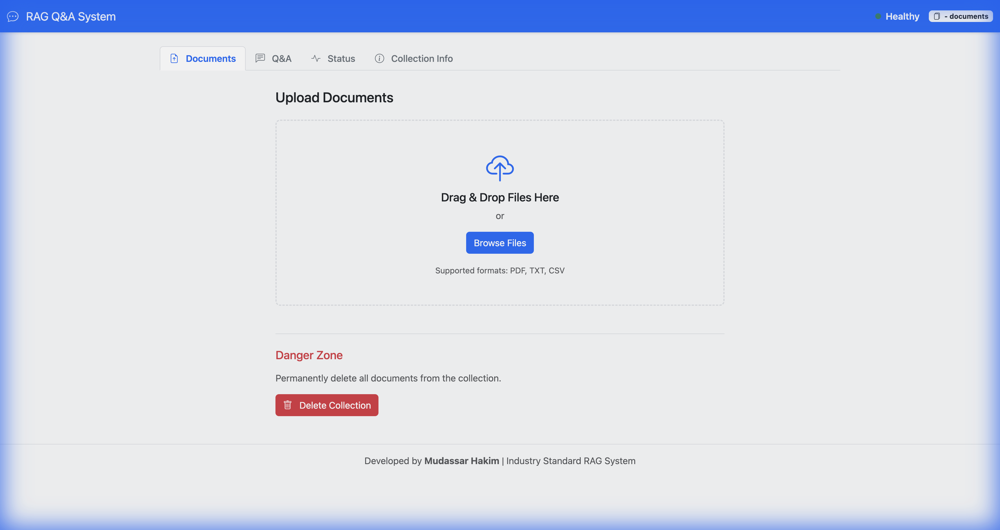
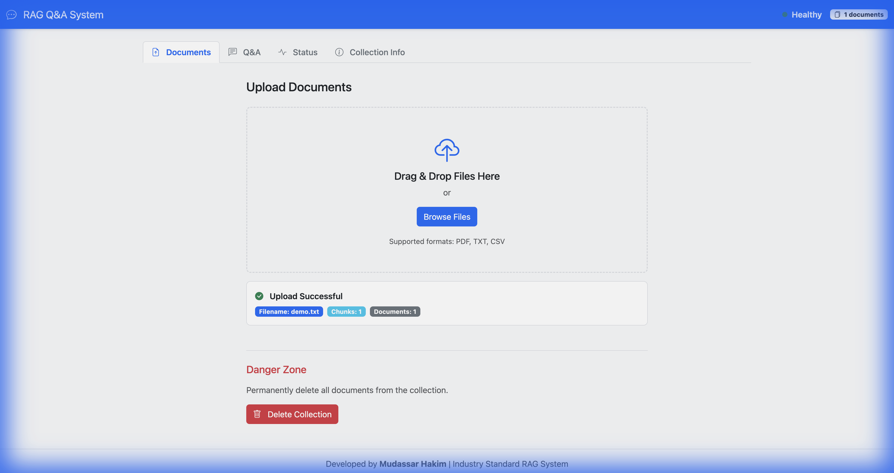
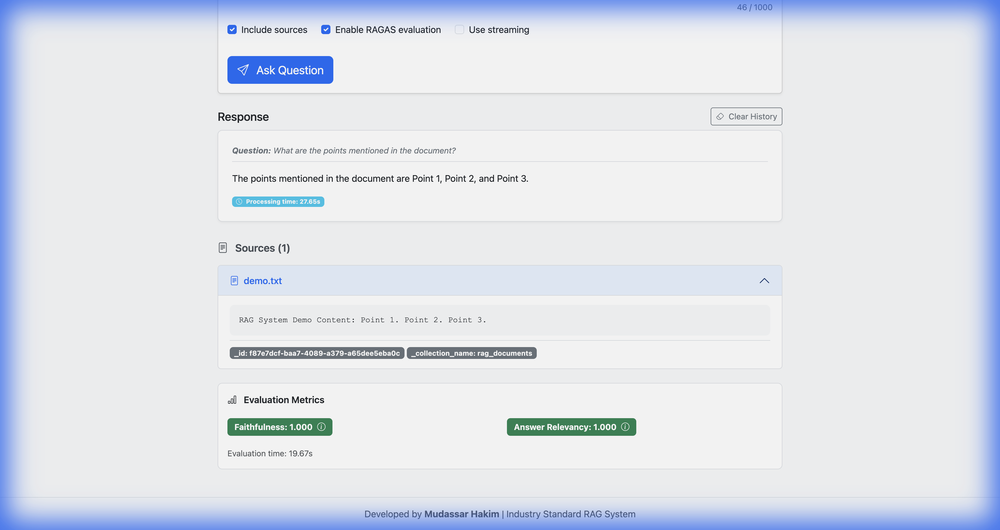
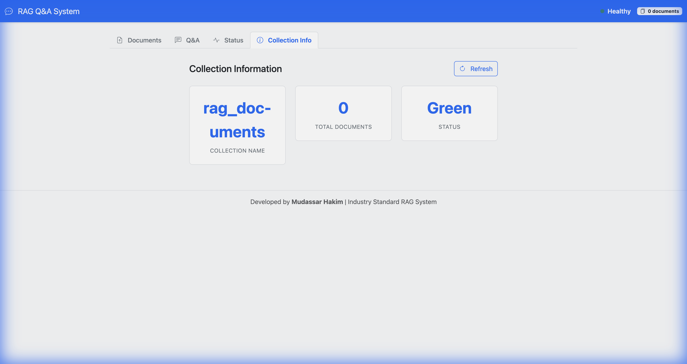

# RAG Q&A System - Technical Walkthrough

This repository contains a production-ready Retrieval-Augmented Generation (RAG) system built with modern AI orchestration and web frameworks.

## 🏗️ Architecture Overview

The system is split into a **FastAPI backend** and a **Bootstrap 5 frontend**, orchestrating document processing, vector storage, and LLM queries.

### 1. Backend Layer (Python/FastAPI)
- **FastAPI**: Provides high-performance async endpoints for document management and Q&A.
- **LangChain (LCEL)**: Used to define the RAG chain, connecting the retriever, prompt template, and OpenAI LLM.
- **Qdrant**: A high-performance vector database used to store and retrieve document embeddings.
- **Ragas**: An evaluation framework that measures the "Faithfulness" and "Answer Relevancy" of the generated responses.

### 2. Frontend Layer (HTML/JS)
- **Vanilla JS & Components**: The UI is built using modular JavaScript (`components.js`, `api.js`, `app.js`) to keep the codebase maintainable without heavy frameworks.
- **Streaming**: Supports real-time token streaming using Server-Sent Events (SSE) logic in the frontend.

## 🛠️ Key Components

| Component | Responsibility |
|-----------|----------------|
| `RAGChain` | Orchestrates the flow from query to final answer. |
| `DocumentProcessor` | Handles PDF, TXT, and CSV loading + chunking. |
| `VectorStoreService` | Manages Qdrant collections and similarity searches. |
| `RAGASEvaluator` | Performs automated quality checks on LLM answers. |

## 🚀 Technical Flow

1. **Ingestion**: User uploads a file -> `DocumentProcessor` chunks it -> `VectorStoreService` embeds and stores it in Qdrant.
2. **Retrieval**: User asks a question -> System searches Qdrant for the top-$k$ most relevant chunks.
3. **Generation**: Top chunks are injected into a prompt -> OpenAI generates the final answer.
4. **Evaluation**: If enabled, Ragas compares the answer against the context and the question to provide quality scores.

## 📺 Demonstration & Verification

### Video Walkthrough
The following recording demonstrates the complete system capability:
1. **System Health Check**: Verifying readiness.
2. **Document Ingestion**: Uploading and chunking a text document.
3. **AI Q&A**: Generating a response based on the uploaded context.
4. **RAGAS Evaluation**: Measuring Faithfulness and Relevancy in real-time.
5. **Collection Cleanup**: Deleting ingested documents.

### Key Verification Steps
Screenshots captured during the demonstration process to verify system states.

- **Empty Home Page**

- **Successful Document Upload**

- **Answer and RAGAS Scores**

- **Empty Collection After Cleanup**

