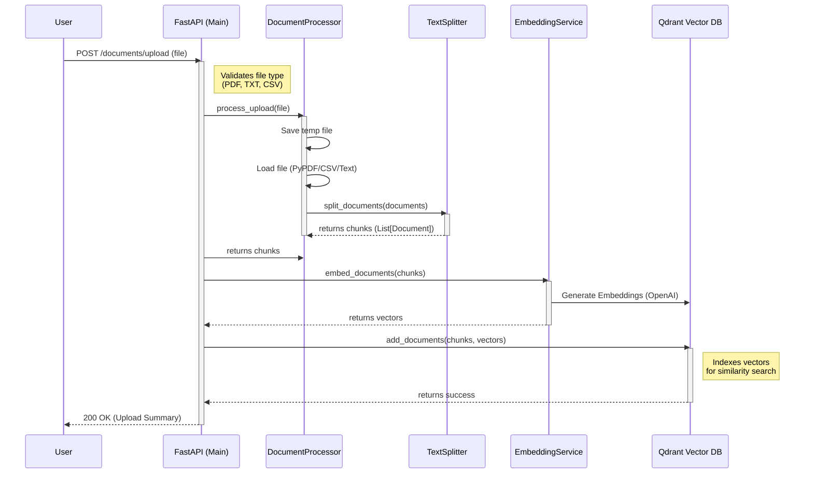
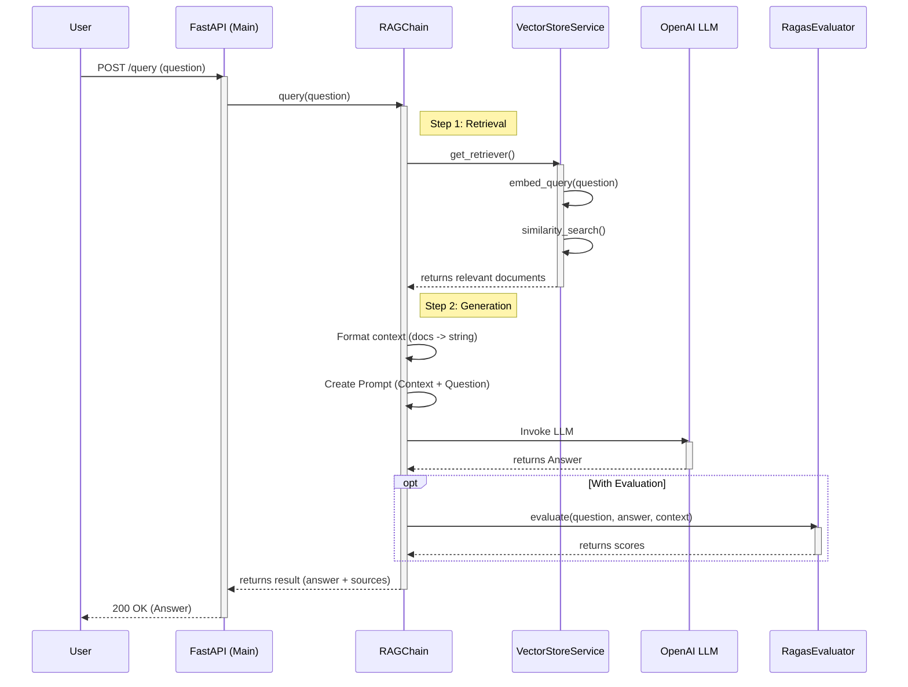

# System Sequence Diagrams

This document visualizes the core workflows of the RAG Q&A System using sequence diagrams.

## 1. Document Ingestion Flow

This flow illustrates how a document travels from the user's upload to being indexed in the vector database.

## 2. RAG Query Flow

This flow shows how a user's question is answered using retrieved context.

